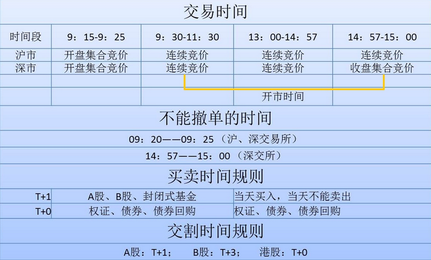

# 概述

最近交易规则引入熔断机制，简单的说沪深300指数上涨或下跌5%的，市场熔断（暂停）15分钟，上涨或下跌7%的，当日直接闭市--见[交易规则](http://www.szse.cn/main/rule/bsywgz/jyl/ybgd_front/39757881.shtml)。本人还是第一次详细的看交易规则，里面的字句斟酌十分严谨，主要有几个重点：

##交易时间：如下图

**连续竞价阶段**，才能进行市价委托，集合竞价阶段。

**9:25 - 9:30**，只接受申报，但不对申报进行处理

**注意不能撤单时间**，也就是说，9:15-9:20可以报一些大单来影响集合竞价（只要在9:20前撤掉单就行了，而9：20-9：25继续进行集合竞价交易）。

##成交

这个非常重要，简单的说就是按价格优先、时间优先的原则进行。

> 集合竞价时,成交价的确定原则为:
> 
> (一)可实现最大成交量; 
> 
> (二)高于该价格的买入申报与低于该价格的卖出申报全部成交; 
> 
> (三)与该价格相同的买方或卖方至少有一方全部成交。 
>
> 两个以上价格符合上述条件的,取在该价格以上的买入申报累计数量与在该价格以下的卖出申报累计数量之差最小的价格为成交价; 
> 
> 买卖申报累计数量之差仍存在相等情况的,开盘集合竞价时取最接近即时行情显示的前收盘价为成交价,盘中、收盘集合竞价时取最接近 最近成交价的价格为成交价。
> 
> 集合竞价的所有交易以同一价格成交。


**有空要用代码实现一下上面的规则，才能对他有更深的理解**


> 连续竞价时,成交价的确定原则为:
>
>(一)最高买入申报与最低卖出申报价格相同,以该价格为成交价;
>
>(二)买入申报价格高于集中申报簿当时最低卖出申报价格时, 以集中申报簿当时的最低卖出申报价格为成交价;
>
>(三)卖出申报价格低于集中申报簿当时最高买入申报价格时, 以集中申报簿当时的最高买入申报价格为成交价。


这个连续竞价的容易理解些。

##大宗交易
它分为协议交易和盘后交易两种，协议交易除了普通交易时间段可以申报外，3：00-3：30也可以申报！而盘后交易在3：05-3：30可以申报。
>协议大宗交易,是指大宗交易双方互为指定交易对手方,协商确
定交易价格及数量的交易方式。 
>
>盘后定价大宗交易,是指证券交易收盘后按照时间优先的原则,
以证券当日收盘价或证券当日成交量加权平均价格对大宗交易买卖申报逐笔连续撮合的交易方式。

**这个盘后定价大宗交易，用收盘价还是证券当日成交量加权平均价格来撮合呢？**

#债券质押式回购
> 债券回购交易申报中,融资方按“买入”方向进行申报,融券 方按“卖出”方向进行申报
>
>债券质押式回购交易实行一次交易、两次结算。回购交易 达成后,初次结算的结算价格为 100 元,回购到期二次结算的结算价 格为购回价,购回价是指每百元资金的本金和利息之和。

#交易系统开源软件

不知道有没类似的开源软件，感觉都能通过这些规则，制定一个交易系统了。.

